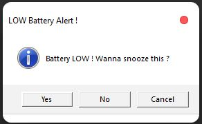
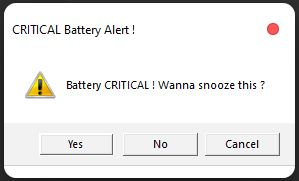
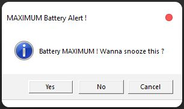
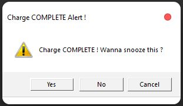
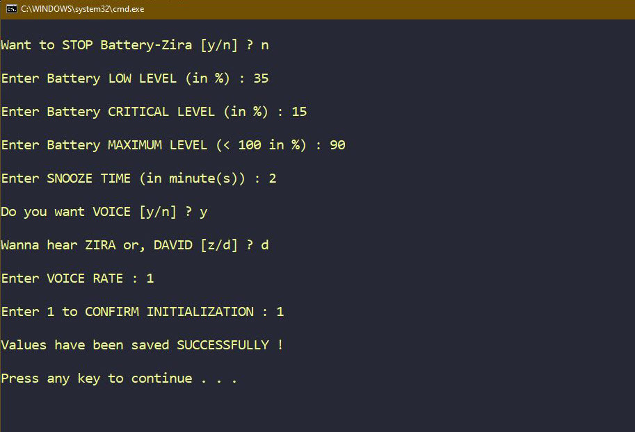

# Battery-Zira

  
  
  
  

  
  

A Windows based program that gives voice reminder based on _low_, _critical_, _maximum_ and _fully charged_ battery levels in a laptop

<table align=center>
  <tr align=center valign=middle>
    <td></td>
    <td></td>
  <tr>
  <tr align=center valign=middle>
    <td></td>
    <td><a href="https://github.com/JustABeginning/Battery-Zira#JAB"></td>
  <tr>
</table>

  

## Install

- [Download](https://github.com/JustABeginning/Battery-Zira/releases) the zip file and extract/save it in a folder (Give it any name) [All the extracted components must be in the same folder].

### Auto

1. Go to the extracted folder.
1. Click on `Install.bat` file.

### Manual

1. Go to the extracted folder.
1. Create a _shortcut_ of `Launch_BAT.bat` file.
1. Press `Win+R` from keyboard or, open windows run menu, then type `shell:startup` and press enter.
1. Save the shortcut created in **step-2** in the location which opens in **step-3**.
1. Return back to the folder of **step-1** and click on `Launch_BAT.bat` file.

## Note

- In order to set custom values, use `Custom_Battery_Level.bat` file.

  

- To skip the value of a parameter, press enter. This will accept the default/recently saved (if any) value for that parameter.
- For a parameter accepting numerical values, only _non-zero_ **positive** _integral_ values are allowed.
- The DEFAULT VALUES are:
  - Stop Battery-Zira - no
  - Low battery level - 40 %
  - Critical battery level - 20 %
  - Maximum battery level - 80 %
  - Snooze time - 1 minute
  - Enable voice - no
  - Voice assistant - Zira
  - Voice rate - 2
- If the program has been stopped, it can be re-triggered using `Install.bat` file.

## Uninstall

### Auto

1. Click on `Uninstall.bat` file.

### Manual

1. Delete the `Launch_BAT.bat` _shortcut_ from the location which opens in **step-3** of **_Install_**.
1. Restart the Computer.

## 🧋 Contribution

Pull requests, issue reports and suggestions are welcome 😊 !

## :clap: A Big Thanks To

### Stargazers

